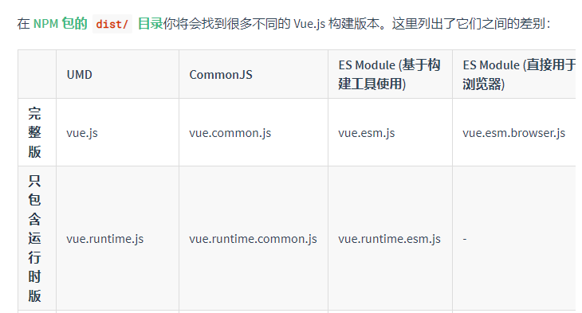

# 更深一层了解： Vue两个版本的区别和使用方法

  在我们使用  vue时，我们可以引用两个不同版本的 Vue，分别是 Vue完整版（vue.js）和 Vue（vue.runtime.js	）非完整版，那么它们的区别是什么呢，今天我们就来分析下这两个不同版本之间的区别。

## 1、文件名


## 2、文件大小

完整版：同时包含编译器和运行时的版本。

编译器：用来将模板字符串编译成为 JavaScript 渲染函数的代码。

而非完整版不包含编译器，体积约比完整版小 30%。

## 3、视图
#### 完整版
视图写在 HTML里或者 template选项里，由于有 compiler(编译器)的存在，完整版运行时：用来创建 Vue 实例、渲染并处理虚拟 DOM 等的代码。基本上就是除去编译器的其它一切。
#### 非完整版
完整版运行时：当使用 vue-loader 或 vueify 的时候，*.vue 文件内部的模板会在构建时预编译成 JavaScript。你在最终打好的包里实际上是不需要编译器的，所以只用运行时版本即可。
```
// 不需要编译器
new Vue({
  render (h) {
    return h('div', this.hi)
  }
})

// 需要编译器
new Vue({
  template: '<div>{{ hi }}</div>'
})
```
## 4、配置
从 webpack 引入,完整版需要配置 alias,非完整版 是默认配置;

从 @vue/cli 引入,完整版需要额外配置,非完整版 是默认配置。

## 总结
既然这两者有这么多不同,那我们平时用哪个版本呢?

当然是用非完整版了,理由如下:

1.保证用户体验，用户下载的JS文件体积更小，但只支持h函数

2.保证开发体验，开发者可直接在vue文件里写HTML标签，而不写 h函数

3.活让loader做，vue-loader 会把vue文件里的HTML转为h函数,这样我不用写太多麻烦的 h函数就可做到和完整版一样的事,还更节约文件大小,提升用户体验。

> 最后,谢谢大家的查看,我是  陈有味  ,如果喜欢我的分享的话,请点赞转发多多支持.
